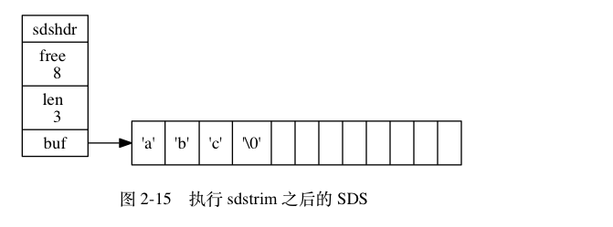

# SDS 与 C 字符串的区别

C 语言使用长度为 N+1 的字符数组来表示长度为 N 的字符串，并且字符数组的最后一个元素是空字符 '\0'。


C 语言这种简单的字符串表示方法不能满足 Redis 对字符串在安全性、效率等多方面的要求。

## 常数复杂度获取字符串长度

C 的字符串不记录自身的长度信息，获取长度比较遍历整个字符串，知道遇到空字符为止，整个操作复杂度为 O(N)。

和 C 字符串不同，SDS 在 len 属性中记录了自身的长度，所以访问 SDS 的 len 属性就可以获取字符串长度。


设置和更新 SDS 长度是有 SDS 的 API 执行时自动完成，无需手动操作。

## 杜绝缓冲区溢出

除了复杂度之外，C 字符串不记录自身长度还可能带来缓冲区溢出（buffer overflow）的风险。

<string.h>/strcat 函数可以将 src 字符串的内容拼接到 dest 字符串的末尾：

```c
char *strcat(char *dest, const char *src);
```

因为 C 字符串不记录自身长度，如果执行函数时 dest 分配的内存不足，就会产生缓冲区溢出。  


与 C 字符串不同， SDS 的空间分配策略完全杜绝了发生缓冲区溢出的可能性： 当 SDS API 需要对 SDS 进行修改时， API 会先检查 SDS 的空间是否满足修改所需的要求， 如果不满足的话， API 会自动将 SDS 的空间扩展至执行修改所需的大小， 然后才执行实际的修改操作， 所以使用 SDS 既不需要手动修改 SDS 的空间大小， 也不会出现前面所说的缓冲区溢出问题。

## 减少修改字符串时带来的内存重分配次数

正如前两个小节所说， 因为 C 字符串并不记录自身的长度， 所以对于一个包含了 `N` 个字符的 C 字符串来说， 这个 C 字符串的底层实现总是一个 `N+1` 个字符长的数组（额外的一个字符空间用于保存空字符）。

因为 C 字符串的长度和底层数组的长度之间存在着这种关联性， 所以每次增长或者缩短一个 C 字符串， 程序都总要对保存这个 C 字符串的数组进行一次内存重分配操作：

- 如果程序执行的是增长字符串的操作， 比如拼接操作（append）， 那么在执行这个操作之前， 程序需要先通过内存重分配来扩展底层数组的空间大小 —— 如果忘了这一步就会产生缓冲区溢出。

- 如果程序执行的是缩短字符串的操作， 比如截断操作（trim）， 那么在执行这个操作之后， 程序需要通过内存重分配来释放字符串不再使用的那部分空间 —— 如果忘了这一步就会产生内存泄漏。

  

因为内存重分配涉及复杂的算法， 并且可能需要执行系统调用， 所以它通常是一个比较耗时的操作：

- 在一般程序中， 如果修改字符串长度的情况不太常出现， 那么每次修改都执行一次内存重分配是可以接受的。
- 但是 Redis 作为数据库， 经常被用于速度要求严苛、数据被频繁修改的场合， 如果每次修改字符串的长度都需要执行一次内存重分配的话， 那么光是执行内存重分配的时间就会占去修改字符串所用时间的一大部分， 如果这种修改频繁地发生的话， 可能还会对性能造成影响。

为了避免 C 字符串的这种缺陷， SDS 通过未使用空间解除了字符串长度和底层数组长度之间的关联： 在 SDS 中， `buf` 数组的长度不一定就是字符数量加一， 数组里面可以包含未使用的字节， 而这些字节的数量就由 SDS 的 `free` 属性记录。

通过未使用空间， SDS 实现了空间预分配和惰性空间释放两种优化策略。

#### 空间预分配

用于优化 SDS 的字符串增长操作：当 SDS 的 API 对一个 SDS 进行修改，并且要对 SDS 进行空间扩展的时候，程序会为 SDS 分配修改所必须的空间，还会额外分配未使用空间。

分配原理：

- 如果对 SDS 进行修改之后， SDS 的长度（也即是 `len` 属性的值）将小于 `1 MB` ， 那么程序分配和 `len` 属性同样大小的未使用空间， 这时 SDS `len` 属性的值将和 `free` 属性的值相同。 举个例子， 如果进行修改之后， SDS 的 `len` 将变成 `13` 字节， 那么程序也会分配 `13` 字节的未使用空间， SDS 的 `buf` 数组的实际长度将变成 `13 + 13 + 1 = 27` 字节（额外的一字节用于保存空字符）。
- 如果对 SDS 进行修改之后， SDS 的长度将大于等于 `1 MB` ， 那么程序会分配 `1 MB` 的未使用空间。 举个例子， 如果进行修改之后， SDS 的 `len` 将变成 `30 MB` ， 那么程序会分配 `1 MB` 的未使用空间， SDS 的 `buf` 数组的实际长度将为 `30 MB + 1 MB + 1 byte` 。

通过空间预分配策略， Redis 可以减少连续执行字符串增长操作所需的内存重分配次数。

#### 惰性空间释放

惰性空间释放用于优化 SDS 的字符串缩短操作： 当 SDS 的 API 需要缩短 SDS 保存的字符串时， 程序并不立即使用内存重分配来回收缩短后多出来的字节， 而是使用 `free` 属性将这些字节的数量记录起来， 并等待将来使用。

举个例子， `sdstrim` 函数接受一个 SDS 和一个 C 字符串作为参数， 从 SDS 左右两端分别移除所有在 C 字符串中出现过的字符。

比如对于图 2-14 所示的 SDS 值 `s` 来说， 执行：

```c
sdstrim(s, "XY");   // 移除 SDS 字符串中的所有 'X' 和 'Y'
```

会将 SDS 修改成图 2-15 所示的样子。




注意执行 `sdstrim` 之后的 SDS 并没有释放多出来的 `8` 字节空间， 而是将这 `8` 字节空间作为未使用空间保留在了 SDS 里面， 如果将来要对 SDS 进行增长操作的话， 这些未使用空间就可能会派上用场。

通过惰性空间释放策略， SDS 避免了缩短字符串时所需的内存重分配操作， 并为将来可能有的增长操作提供了优化。

与此同时， SDS 也提供了相应的 API ， 让我们可以在有需要时， 真正地释放 SDS 里面的未使用空间， 所以不用担心惰性空间释放策略会造成内存浪费。

### 二进制安全

C 字符串中的字符必须符合某种编码（比如 ASCII）， 并且除了字符串的末尾之外， 字符串里面不能包含空字符， 否则最先被程序读入的空字符将被误认为是字符串结尾 —— 这些限制使得 C 字符串只能保存文本数据， 而不能保存像图片、音频、视频、压缩文件这样的二进制数据。

举个例子， 如果有一种使用空字符来分割多个单词的特殊数据格式， 如图 2-17 所示， 那么这种格式就不能使用 C 字符串来保存， 因为 C 字符串所用的函数只会识别出其中的 `"Redis"` ， 而忽略之后的 `"Cluster"` 。


虽然数据库一般用于保存文本数据， 但使用数据库来保存二进制数据的场景也不少见， 因此， 为了确保 Redis 可以适用于各种不同的使用场景， SDS 的 API 都是二进制安全的（binary-safe）： 所有 SDS API 都会以处理二进制的方式来处理 SDS 存放在 `buf` 数组里的数据， 程序不会对其中的数据做任何限制、过滤、或者假设 —— 数据在写入时是什么样的， 它被读取时就是什么样。

这也是我们将 SDS 的 `buf` 属性称为字节数组的原因 —— Redis 不是用这个数组来保存字符， 而是用它来保存一系列二进制数据。

比如说， 使用 SDS 来保存之前提到的特殊数据格式就没有任何问题， 因为 SDS 使用 `len` 属性的值而不是空字符来判断字符串是否结束。

通过使用二进制安全的 SDS ， 而不是 C 字符串， 使得 Redis 不仅可以保存文本数据， 还可以保存任意格式的二进制数据。

## 兼容部分 C 字符串函数

虽然 SDS 的 API 都是二进制安全的， 但它们一样遵循 C 字符串以空字符结尾的惯例： 这些 API 总会将 SDS 保存的数据的末尾设置为空字符， 并且总会在为 `buf` 数组分配空间时多分配一个字节来容纳这个空字符， 这是为了让那些保存文本数据的 SDS 可以重用一部分 `<string.h>` 库定义的函数。


举个例子， 如图 2-19 所示， 如果我们有一个保存文本数据的 SDS 值 `sds` ， 那么我们就可以重用 `<string.h>/strcasecmp` 函数， 使用它来对比 SDS 保存的字符串和另一个 C 字符串：

```
strcasecmp(sds->buf, "hello world");
```

这样 Redis 就不用自己专门去写一个函数来对比 SDS 值和 C 字符串值了。

与此类似， 我们还可以将一个保存文本数据的 SDS 作为 `strcat` 函数的第二个参数， 将 SDS 保存的字符串追加到一个 C 字符串的后面：

```
strcat(c_string, sds->buf);
```

这样 Redis 就不用专门编写一个将 SDS 字符串追加到 C 字符串之后的函数了。

通过遵循 C 字符串以空字符结尾的惯例， SDS 可以在有需要时重用 `<string.h>` 函数库， 从而避免了不必要的代码重复。

## 总结

| C 字符串                                             | SDS                                                  |
| ---------------------------------------------------- | ---------------------------------------------------- |
| 获取字符串长度的复杂度为 O(N) 。                     | 获取字符串长度的复杂度为 O(1) 。                     |
| API 是不安全的，可能会造成缓冲区溢出。               | API 是安全的，不会造成缓冲区溢出。                   |
| 修改字符串长度 `N` 次必然需要执行 `N` 次内存重分配。 | 修改字符串长度 `N` 次最多需要执行 `N` 次内存重分配。 |
| 只能保存文本数据。                                   | 可以保存文本或者二进制数据。                         |
| 可以使用所有 `<string.h>` 库中的函数。               | 可以使用一部分 `<string.h>` 库中的函数。             |

